# RoboMaster平衡步兵机器人控制系统设计

本文介绍 哈尔滨工程大学 创梦之翼战队 RoboMaster 2022 赛季平衡步兵机器人的控制系统设计，我队平衡步兵机器人采用 轮腿构型，结合了轮与腿两种构型的优点，在具有轮驱的高能效优点的同时收获腿带来的良好地形适应性。相比于足式机器人，驱动轮可使机器人更容易获得较高的移动速度；相比于传统轮式 倒立摆机器人，腿的加入使机器人机构获得了更多的自由度、为机器人的平衡与运动提供了新的思路，可以极大程度提升倒立摆机器人的运动表现。

## 1 平衡与纵向运动控制

### 1.1 系统建模

#### 1.1.1 模型定义

对于机器人平衡与纵向运动问题，主要关注机器人上层机构与腿部的姿态以及驱动轮的运动，并忽略机器人腿长变化，仅考虑腿的姿态，即驱动轮轴与腿部两关节电机转轴中心的连线相对惯性系的角度。

称机器人上层机构为机体、驱动轮轴与腿部机构转轴的连线为摆杆，得到如图所示轮腿倒立摆模型。

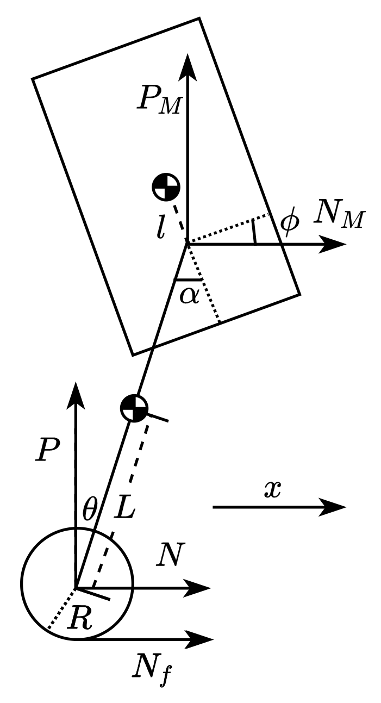
*图 1 轮腿倒立摆模型*

该模型变量与参数定义如表所示。

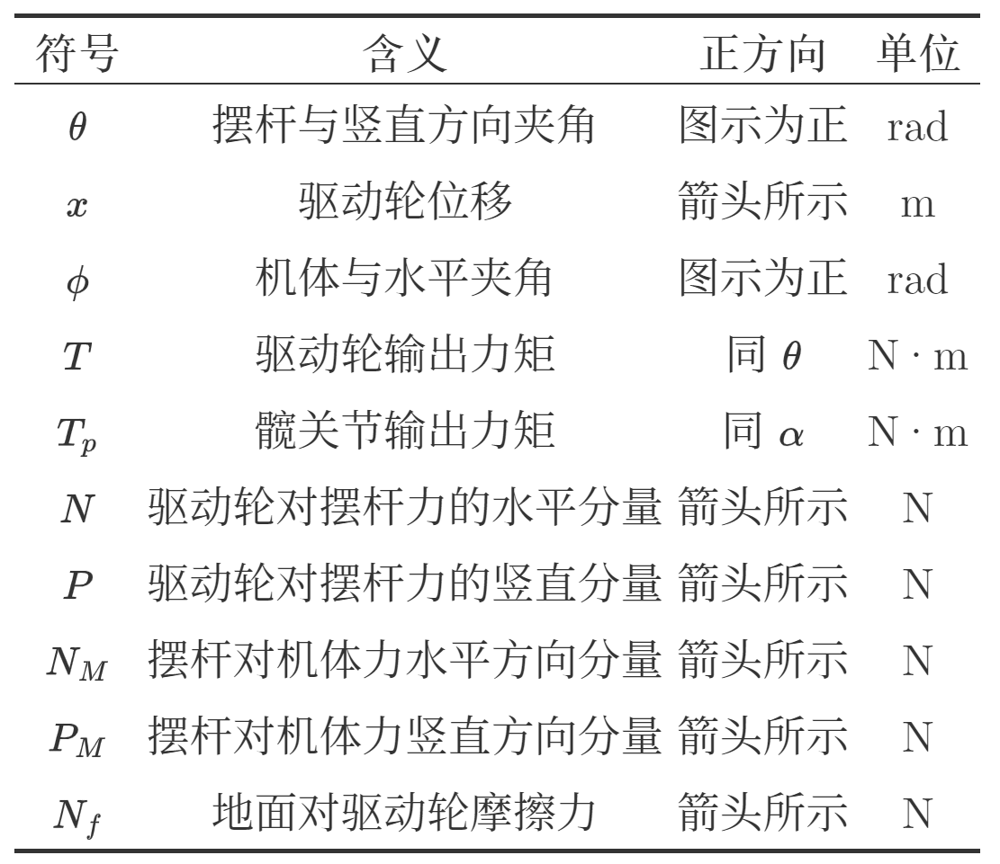
*图 2 模型变量定义表（上）*

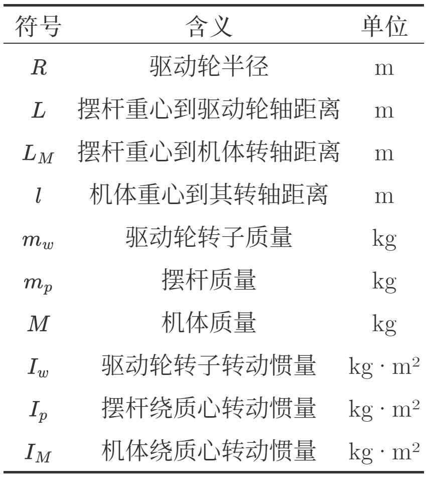
*图 3 模型变量定义表（下）*

#### 1.1.2 经典力学分析

对驱动轮，有：

$$
\begin{aligned}
m_w\ddot x=N_f - N                                  (1.1) \\
I_w\frac{\ddot x}{R}=T - N_fR                      (1.2)
\end{aligned}
$$

合并式 (1.1)、(1.2) 消去 $N_f$ 得到 $\ddot x$ 表达式：

$$
\ddot x = \frac{T - NR}{\frac{I_w}{R}+m_wR}         (1.3)
$$

对摆杆，有：

$$
\begin{aligned}
N-N_M = m_p \frac{\partial^2}{\partial t^2}(x+L \sin\theta)                (1.4) \\
P-P_M - m_pg = m_p\frac{\partial^2}{\partial t^2}\left(L \cos\theta\right)    (1.5) \\
I_p\ddot\theta = (PL+P_ML_M)\sin\theta -(NL+N_ML_M)\cos\theta - T+T_p     (1.6)
\end{aligned}
$$

对机体，有：

$$
\begin{aligned}
N_M = M \frac{\partial^2}{\partial t^2}(x + (L+L_M) \sin\theta-l \sin\phi)   (1.7) \\
P_M-Mg = M\frac{\partial^2}{\partial t^2}((L+L_M)\cos\theta+l\cos\phi)         (1.8) \\
I_M\ddot\phi = T_p + N_Ml\cos\phi+P_Ml\sin\phi                                         (1.9)
\end{aligned}
$$

#### 1.1.3 状态空间模型

定义状态向量 $\boldsymbol x$ 与控制向量 $\boldsymbol u$ 分别为：

$$
\begin{aligned}
\boldsymbol x = \left[\begin{array}{c} \theta \\ \dot\theta \\ x \\ \dot x \\ \phi \\ \dot\phi \\ \end{array}\right] \\
\boldsymbol u = \left[\begin{array}{c} T \\ T_p \\ \end{array}\right]
\end{aligned}
$$

定义系统非线性模型：

$$
\dot{\boldsymbol x} = f(\boldsymbol x,\boldsymbol u)
$$

利用MATLAB符号运算工具，根据式 (1.4)、(1.5)、(1.7)、(1.8) 消去中间变量 P,N,$P_M$,$N_M$，并利用函数solve对式 (1.3)、(1.6)、(1.9) 进行求解以得到系统非线性模型符号表达式。根据式状态向量 $\boldsymbol x$ 与控制向量 $\boldsymbol u$，求非线性模型平衡点处雅可比矩阵对其线性化，即：

$$
\begin{aligned}
\boldsymbol A = \frac{\partial f}{\partial \boldsymbol x}(\bar {\boldsymbol x},\bar {\boldsymbol u}), \\
\boldsymbol B = \frac{\partial f}{\partial \boldsymbol u}(\bar {\boldsymbol x},\bar {\boldsymbol u})
\end{aligned}
$$

其中 $\bar {\boldsymbol x}$,$\bar {\boldsymbol u}$ 为系统平衡点，即方程 $f(\bar {\boldsymbol x},\bar {\boldsymbol u})=0$ 的解：

$$
\begin{aligned}
\bar {\boldsymbol x} = \left[\begin{array}{c} 0 \\ 0 \\ x \\ 0 \\ 0 \\ 0 \\ \end{array}\right] \\
\bar {\boldsymbol u }= \left[\begin{array}{c} 0 \\ 0 \\ \end{array}\right]
\end{aligned}
$$

有：

$$
\dot {\boldsymbol x} =
\left[\begin{array}{cccccc}
0 & 1 & 0 & 0 & 0 & 0 \\
A_1 & 0 & 0 & 0 & A_2 & 0 \\
0 & 0 & 0 & 1 & 0 & 0 \\
A_3 & 0 & 0 & 0 & A_4 & 0 \\
0 & 0 & 0 & 0 & 0 & 1 \\
A_5 & 0 & 0 & 0 & A_6 & 0 \\
\end{array}\right]{\boldsymbol x}
+
\left[\begin{array}{cc}
0 & 0 \\
B_1 & B_2 \\
0 & 0 \\
B_3 & B_4 \\
0 & 0 \\
B_5 & B_6 \\
\end{array}\right]\boldsymbol u                                           (1.10)
$$

由于表达式较为复杂所占篇幅较大，此处用符号代替。

所有状态变量均可通过直接测量或融合解算得到解析结果，故系统输出 $\boldsymbol y$ 为：

$$
\boldsymbol y = \boldsymbol I_{6}\boldsymbol x
$$

其中 $\boldsymbol I_6$ 为6维单位阵。通过带入模型参数确定该状态空间模型状态矩阵 $\boldsymbol A$ 和控制矩阵 $\boldsymbol B$，其可控矩阵满秩，系统可控。系统输出矩阵 $\boldsymbol C$ 为单位阵，系统显然可观。

### 1.2 控制器设计

#### 1.2.1 LQR

根据上述轮腿倒立摆模型，设计控制律为系统状态的线性组合，即：

$$
\boldsymbol u = -\boldsymbol K \boldsymbol x=
-\left[\begin{array}{cccccc}
K_{11} & K_{12} & K_{13} & K_{14} & K_{15} & K_{16}\\
K_{21} & K_{22} & K_{23} & K_{24} & K_{25} & K_{26}
\end{array}\right]
\left[\begin{array}{c}
\theta \\ \dot\theta \\ x \\ \dot x \\ \phi \\ \dot\phi \\
\end{array}\right]
$$

采用 Linear Quadratic Regulator (LQR) 计算反馈矩阵 $\boldsymbol K$，定义代价函数 J 为：

$$
J = \int^\infty_0\left(x^T\boldsymbol Qx+u^T\boldsymbol R u\right)\mathrm dt
$$

为使代价函数 J 最小，输入 $\boldsymbol u$ 应满足：

$$
\boldsymbol u = -\boldsymbol R^{-1}\boldsymbol B^T\boldsymbol P \boldsymbol x
$$

即反馈增益 $\boldsymbol K$ 满足：

$$
\boldsymbol K = \boldsymbol R^{-1}\boldsymbol B^T\boldsymbol P
$$

其中 $\boldsymbol P$ 满足代数Riccati方程：

$$
\boldsymbol A^{T} \boldsymbol P+\boldsymbol P \boldsymbol A-\boldsymbol P \boldsymbol B \boldsymbol R^{-1} \boldsymbol B^{T} \boldsymbol P+\boldsymbol Q=0
$$

通过上述方法即可在线性化平衡点附近实现系统稳定。为使机器人跟踪轨迹，还需在系统输入中加入参考输入，即：

$$
\boldsymbol u = \boldsymbol K(\boldsymbol x_d-\boldsymbol x)
$$

其中参考输入 $\boldsymbol x_d$ 由机器人位置期望 $\widetilde x$ 构成：

$$
\boldsymbol x_d = \left[\begin{array}{c} 0 \\ 0 \\ \widetilde x \\ 0 \\ 0 \\ 0 \\ \end{array}\right]
$$

为考虑机器人不同腿长的工况，在腿长区间内每10mm对系统模型进行一次线性化，并求解其反馈增益矩阵 $\boldsymbol K$。对矩阵每一个元素 $K_{ij}$ 随腿长 $L_0 = L+L_M$ 的变化拟合多项式方程得到：

$$
K_{ij}(L_0) = p_{0|ij} + p_{1|ij}L_0+p_{2|ij} L_0^2+p_{3|ij} L_0^3    (1.11)
$$

综上，机器人纵向运动控制律为：

$$
\boldsymbol u = \boldsymbol K(L_0)(\boldsymbol x_d-\boldsymbol x)
$$

#### 1.2.2 VMC

要得到机器人腿长 $L_0$ 需要对机器人腿部平面五杆机构进行正运动学解算。而轮腿倒立摆模型中 $T_p$ 则需要运用虚拟模型控制 VMC (virtual model control) 的思想，根据 $T_p$ 获得两关节电机输出扭矩。五连杆参数定义如图所示。

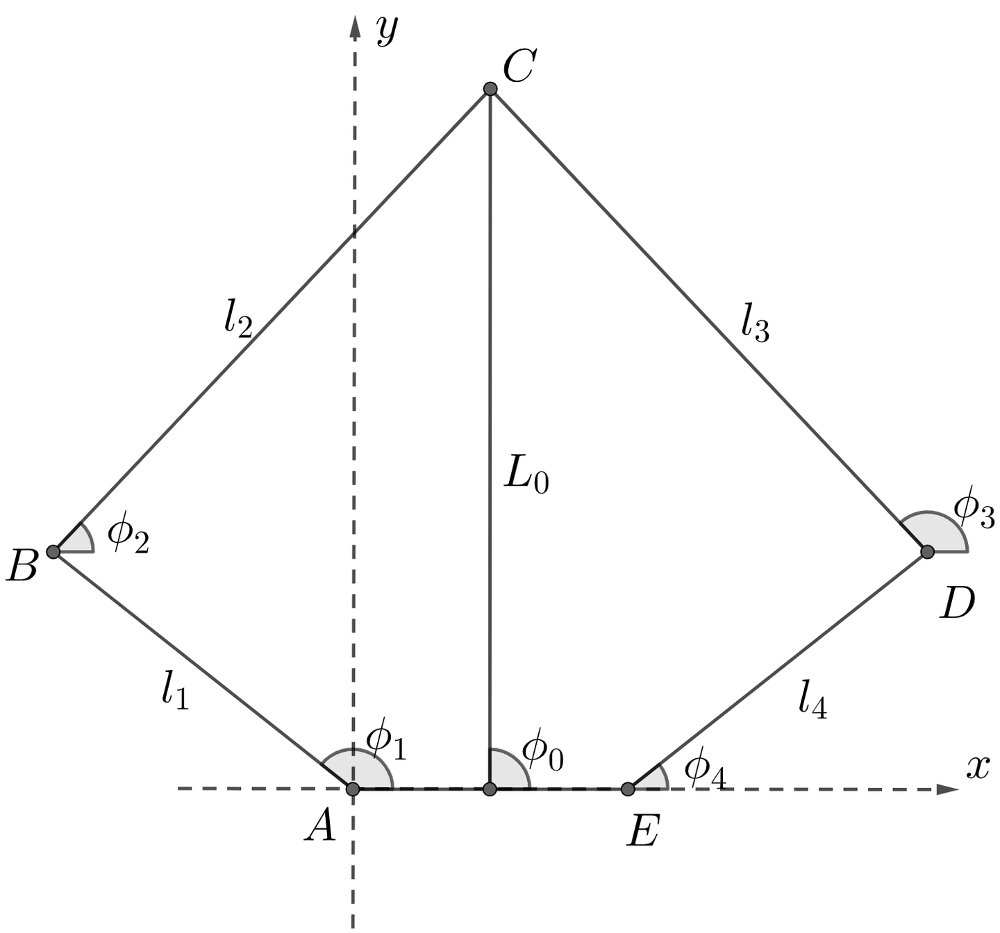
*图 4 五连杆参数定义*

如图，有：

$$
\left\{\begin{array}{l}
{x}_{{B}}+{l}_{2} \cos \phi_{2}={x}_{{D}}+{l}_{3} \cos \phi_{3} \\
{y}_{{B}}+{l}_{2} \sin \phi_{2}={y}_{{D}}+{l}_{3} \sin \phi_{3}
\end{array}\right.
$$

求解方程组可得角度 $\phi_2$ ：

$$
\phi_{2}=2 \arctan \left(\frac{{B}_{0} + \sqrt{{A}_{0}^{2}+{B}_{0}^{2}-{C}_{0}^{2}}}{{A}_{0}+{C}_{0}}\right)
$$

其中：

$$
\begin{aligned}
A_0 = 2l_2(x_D-x_B) \\
B_0 = 2l_2(y_D-y_B) \\
C_0 = l_2^2+l_{BD}^2-l_3^2 \\
l_{BD} = \sqrt{(x_D-x_B)^2+(y_D-y_B)^2}
\end{aligned}
$$

得到角度 $\phi_2$ 后即可解算出 C 点坐标。

VMC (virtual model control) 是一种直觉控制方式，其关键是在每个需要控制的自由度上构造恰当的虚拟构件以产生合适的虚拟力。虚拟力不是实际执行机构的作用力或力矩，而是通过执行机构的作用经过机构转换而成。为了将工作空间 (Task Space) 的力或力矩映射成关节空间 (Joint Space) 的关节力矩，需要这两个空间的位置映射关系，即正运动学模型：

$$
\boldsymbol x = f(\boldsymbol q)
$$

其中，$\boldsymbol x = [L_0 \;\; \phi_0]^T$，$\boldsymbol q = [\phi_1 \;\; \phi_4]^T$。求 $\boldsymbol x$ 全微分得：

$$
\left\{\begin{array}{c}
\delta L_{0}=\frac{\partial f_{1}}{\partial \phi_{1}} \delta \phi_{1}+\frac{\partial f_{1}}{\partial \phi_{4}} \delta \phi_{4} \\
\delta \phi_{0}=\frac{\partial f_{2}}{\partial \phi_{1}} \delta \phi_{1}+\frac{\partial f_{2}}{\partial \phi_{4}} \delta \phi_{4}
\end{array}\right.
$$

即：

$$
\delta \boldsymbol{x}=
\left[\begin{array}{cc}
\frac{\partial f_{1}}{\partial \phi_{1}} & \frac{\partial f_{1}}{\partial \phi_{4}} \\
\frac{\partial f_{2}}{\partial \phi_{1}} & \frac{\partial f_{2}}{\partial \phi_{4}}
\end{array}\right]
\delta \boldsymbol{q}
$$

定义雅可比矩阵 $\boldsymbol J$ 为：

$$
\boldsymbol{J}=
\left[\begin{array}{cc}
\frac{\partial f_{1}}{\partial \phi_{1}} & \frac{\partial f_{1}}{\partial \phi_{4}} \\
\frac{\partial f_{2}}{\partial \phi_{1}} & \frac{\partial f_{2}}{\partial \phi_{4}}
\end{array}\right]
$$

有：

$$
\delta \boldsymbol{x}=\boldsymbol{J} \delta \boldsymbol{q}
$$

即通过雅可比矩阵 $\boldsymbol J$ 将关节速度 $\dot {\boldsymbol q}$ 映射为五连杆姿态变化率 $\dot {\boldsymbol x}$。根据虚功原理，有：

$$
\boldsymbol{T}^{\mathrm{T}} \delta \boldsymbol{q}+(-\boldsymbol{F})^{\mathrm{T}} \delta \boldsymbol{x}=0
$$

其中 $\boldsymbol T = [T_1 \;\; T_2]^T$ 为前后两关节电机输出力矩列向量，$\boldsymbol F = [F \;\; T_p]^T$ 为腿部五连杆机构沿腿的推力 F 与沿中心轴的力矩 $T_p$ 构成的列向量。将式 $\delta \boldsymbol{x}=\boldsymbol{J} \delta \boldsymbol{q}$ 代入，有：

$$
\boldsymbol T = \boldsymbol J^T \boldsymbol F
$$

综上通过正运动学模型雅可比矩阵即可解算出关节电机输出力矩。

### 1.3 仿真验证

通过 Simscape Multibody 搭建图示简易模型验证上文算法可行性。

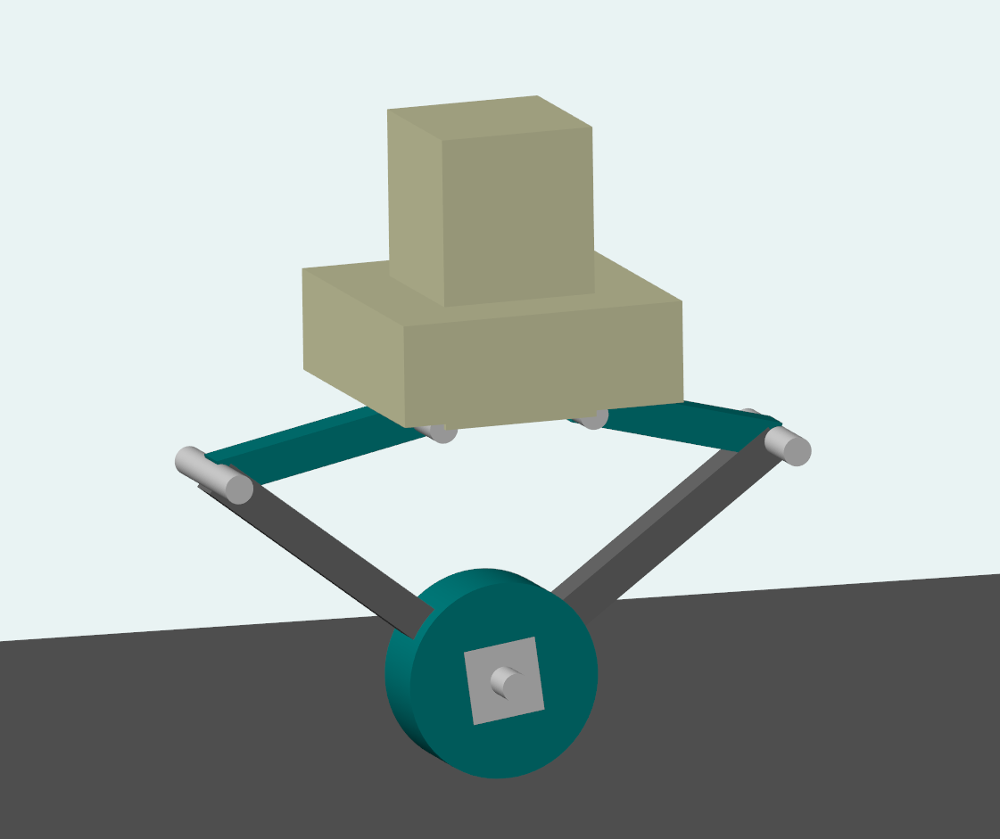
*图 5 Simscape Multibody 简易模型*

带入仿真模型结构参数，可得在腿长 $L_0 = 0.18$ 状态下的系统模型：

$$
\dot {\boldsymbol x} =
\left[\begin{array}{cccccc}
0 & 1 & 0 & 0 & 0 & 0 \\
265.9556 & 0 & 0 & 0 & 80.6327 & 0 \\
0 & 0 & 0 & 1 & 0 & 0 \\
-25.4562 & 0 & 0 & 0 & 1.8637 & 0 \\
0 & 0 & 0 & 0 & 0 & 1 \\
156.6952 & 0 & 0 & 0 & 183.0614 & 0 \\
\end{array}\right]{\boldsymbol x}
+
\left[\begin{array}{cc}
0 & 0 \\
-15.1389 & 13.8563 \\
0 & 0 \\
2.1208 & -0.7158 \\
0 & 0 \\
-4.2238 & 16.8001 \\
\end{array}\right]\boldsymbol u
$$

经计算，其可控矩阵 $\mathcal{C}$ 满足：

$$
\mathrm {rank}( \mathcal{C}) = \mathrm {rank}([\boldsymbol B\; \boldsymbol A\boldsymbol B\; \boldsymbol A^2\boldsymbol B\; ... \; \boldsymbol A^5\boldsymbol B])=6
$$

系统可控。故选取 LQR 权重矩阵为：

$$
\boldsymbol Q =
\left[\begin{array}{cccccc}
1 & 0 & 0 & 0 & 0 & 0 \\
0 & 1 & 0 & 0 & 0 & 0 \\
0 & 0 & 500 & 0 & 0 & 0 \\
0 & 0 & 0 & 100 & 0 & 0 \\
0 & 0 & 0 & 0 & 5000 & 0 \\
0 & 0 & 0 & 0 & 0 & 1 \\
\end{array}\right]
,\;\;
\boldsymbol R = \left[\begin{array}{c} 1 & 0 \\ 0 & 0.25 \\ \end{array}\right]
$$

求解Riccati方程即可得到增益矩阵 $\boldsymbol K$：

$$
\boldsymbol K =
\left[\begin{array}{rrrrrr}
-44.3788 & -6.8496 & -22.2828 & -21.5569 & 28.7706 & 4.3751\\
11.2006 & 0.7339 & 3.7300 & 3.2058 & 151.7300 & 4.6387
\end{array}\right]
$$

令机器人跟踪阶跃速度期望 $\dot {\widetilde x}(t)$：

$$
\dot {\widetilde x}(t) = \left\{ \begin{array}{lc} 1.5, & 0<t<3 \\ 0, & 其他 \end{array}\right.
$$

对其积分可得到机器人期望位置 $\widetilde x(t)$，则机器人期望状态向量 $\boldsymbol x_d(t)$ 为：

$$
\boldsymbol x_d(t) = \left[\begin{array}{c} 0 \\ 0 \\ \widetilde x(t) \\ 0 \\ 0 \\ 0 \\ \end{array}\right]
$$

运动过程机器人位姿表现如图所示。

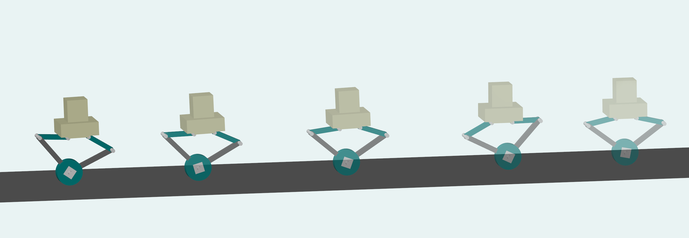
*图 6 仿真位姿变化*

机器人机体俯仰角 $\phi$、腿部姿态角 $\theta$ 与机器人速度 $\dot x$ 曲线如图所示。加速初期，机器人驱动轮向后运动、摆杆向前倾斜，将机器人重心配置到驱动轮前，使驱动轮可以提供匹配的力矩使机器人加速。减速初期，通过驱动轮和关节电机共同作用，将驱动轮移动至机器人重心前方，使驱动轮可以提供令机器人稳定减速的力矩。

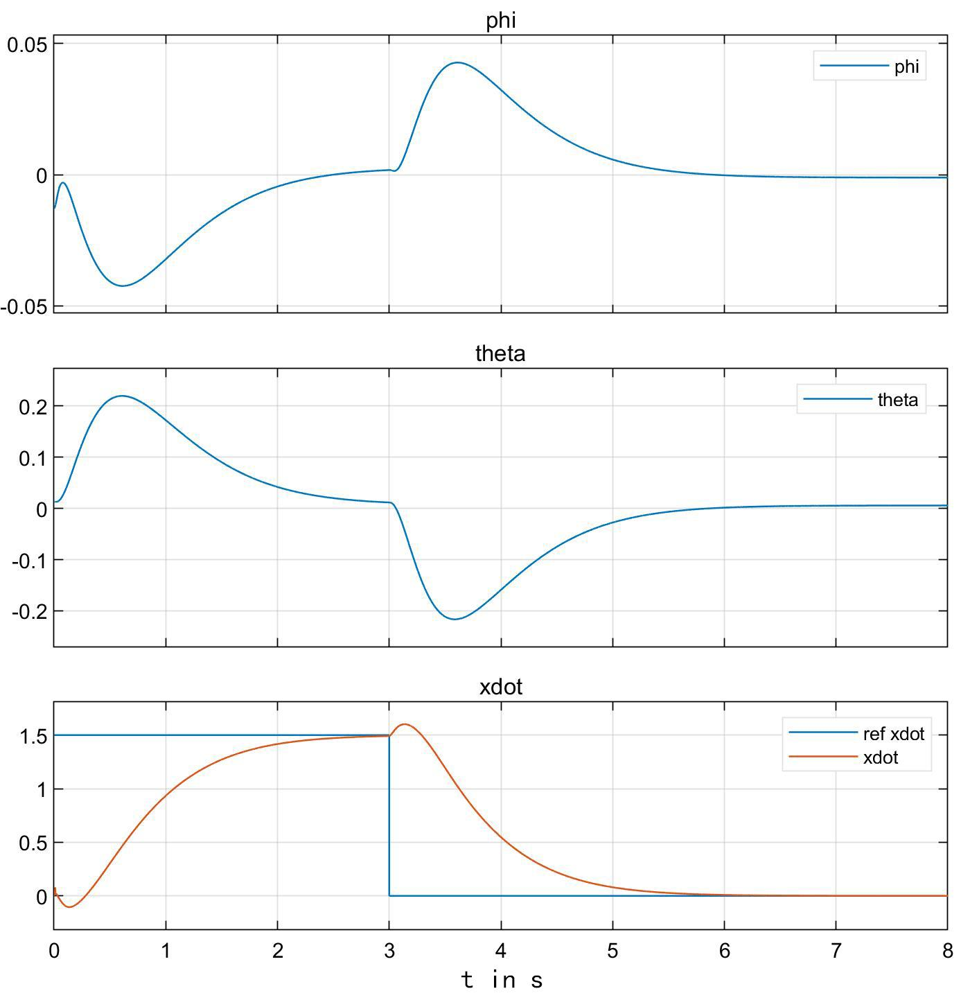
*图 7 仿真姿态与速度曲线*

仿真结果表明，轮腿倒立摆模型与VMC结合可满足腿部五连杆构型平衡步兵的控制要求。

### 1.4 实机效果

通过称重可得到机器人各部分质量；驱动轮转子与轮毂转动惯量利用电机力矩反馈通过系统辨识得到；摆杆转动惯量通过平行轴定理解算得到；机体转动惯量与质心位置则通过机械图纸计算得到，相比通过测量与辨识得到的参数精度较差，只能保证大致准确。

通过这些参数计算得到不完全准确的状态空间模型，再根据式 (1.11) 拟合反馈矩阵 $\boldsymbol K(L_0)$，拟合结果如图所示。

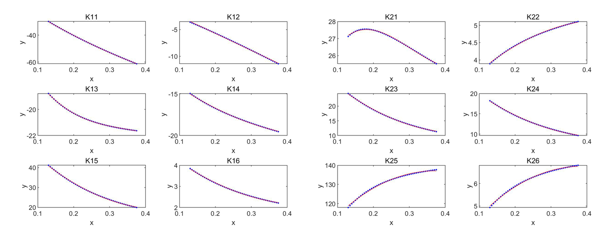
*图 8 增益矩阵拟合结果*

令机器人跟踪初值为 2m/s 的阶跃速度期望，运动过程机器人位姿表现如图所示。

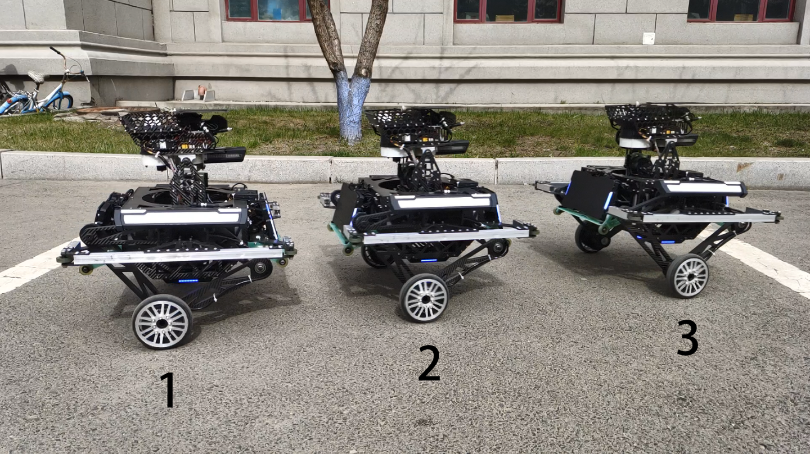
*图 9 实机位姿变化*

机器人机体俯仰角 $\phi$、腿部姿态角 $\theta$ 与机器人速度 $\dot x$ 曲线如图所示。

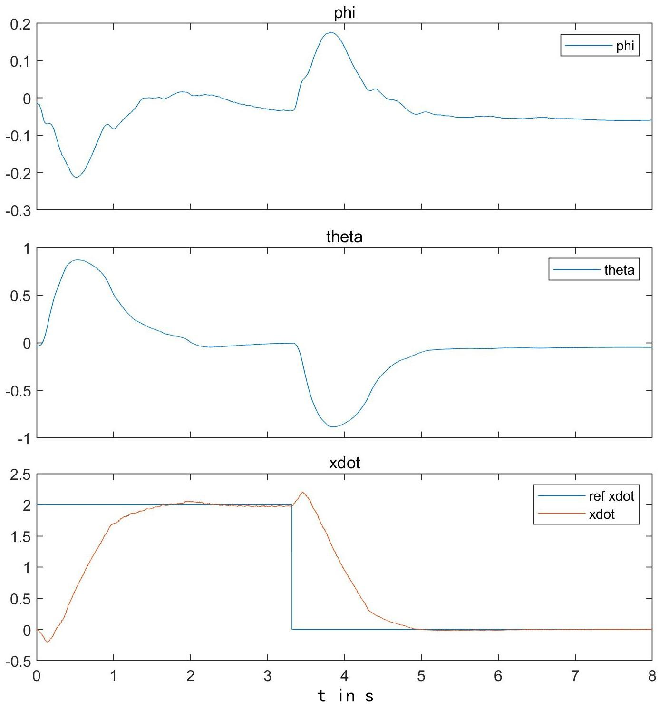
*图 10 实机姿态与速度曲线*

位姿曲线表明，该控制器的实机表现与仿真结果较为一致。其中速度曲线显示机器人在 t=1.6s 时加速至 2m/s，并且在整个运动过程中机器人机体俯仰姿态角 $\phi$ 均保持在 $\pm 13^{\circ}$ 内。说明根据轮腿倒立摆模型设计控制器可以在保证机器人加速性能的同时兼顾上层机构的姿态稳定。

## 2 综合运动控制

平衡与纵向运动是平衡步兵综合运动中最重要的部分，除此之外还需对机器人高度与横滚姿态等状态进行控制。在系统平衡点附近，近似假设机器人的其他运动相互解耦，依此分别设计控制器。

### 2.1 双腿角度控制

#### 2.1.1 转向控制

对于转向控制，可简单采用 PD 控制。期望航向角速度 $\psi_d$ 与姿态解算得到的航向角速度估计值 $\hat\psi$ 的误差经过 PD 控制器得到转向力矩输出，并以相反的符号叠加到状态反馈控制 T 中以得到左右驱动轮电机的期望力矩 ${}^lT$、${}^rT$。

#### 2.1.2 双腿协调

转向过程中驱动轮电机的力矩差会对机器人产生沿接触地面法线的力矩，这个力矩驱动机器人转向的同时也会驱使机器人的双腿向着相反的方向摆动，进而造成“劈叉”，导致平衡控制模型不匹配。

为避免上述情况，需要针对机器人左右腿的角度差 $\delta\theta={}^r\theta-{}^l\theta$ 应用 PD 控制以得到驱使其保持角度一致的力矩输出。将该力矩以相反的符号叠加到状态反馈控制 $T_p$ 中以得到左右腿绕中心轴的期望力矩 ${}^lT_p$、${}^rT_p$。

### 2.2 双腿长度控制

#### 2.2.1 腿长控制

为使腿的长度变化具有弹簧阻尼特性，利用 PD 控制模拟弹簧阻尼，同时利用前馈补偿上层机构的重力。为修正前馈模型误差，引入积分环节，最终采用“PID+前馈”的方式控制机器人左右腿腿长 ${}^lL_0$、${}^rL_0$。

此外，左右腿腿长期望 ${}^lL_d$、${}^rL_d$ 可由机器人期望横滚姿态角 $\gamma_d$ 与解算得到的地面倾角计算得到，以实现在非水平地面上保持机器人机体横滚姿态水平。

#### 2.1.2 横滚角补偿

为使机器人的腿尽可能达到更好的减震效果，控制器模拟的弹簧阻尼系统截止频率要低，故腿长控制中的 $K_p$ 应当尽可能小。较小的 $K_p$ 决定了单纯的“PID+前馈”控制策略难以克服外界的扰动，主要体现在转向过程中的离心作用会使机器人向外倾斜。

为解决上述问题，可采用额外的横滚角补偿以克服离心作用对机器人横滚姿态的影响。将横滚姿态角误差 $\delta\gamma = \gamma_d-\hat\gamma$ 乘以比例增益 $K_\gamma$ 得到补偿输出，将补偿输出以相反的符号叠加到腿长控制的输出力中以得到左右腿沿腿的期望推力 ${}^lF$、${}^rF$。在横滚角补偿与腿长控制的共同作用下，机器人可在如图所示复杂地形下保持机身水平。

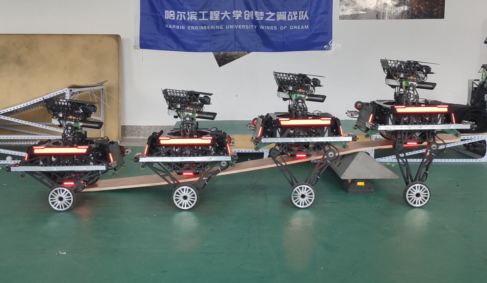
*图 11 复杂地形下的机身水平效果*

### 2.3 综合运动控制系统框图

经过上述控制系统可得到左右驱动轮电机的期望力矩 ${}^lT$、${}^rT$、左右腿绕中心轴的期望力矩 ${}^lT_p$、${}^rT_p$ 与左右腿沿腿的期望推力 ${}^lF$、${}^rF$。最后根据 ${}^lT_p$、${}^rT_p$、${}^lF$、${}^rF$ 利用 VMC 即可解算出机器人左右腿共四个关节电机的期望输出力矩 ${}^lT_1$、${}^lT_2$、${}^rT_1$、${}^rT_2$。至此，便得到了机器人两个驱动轮电机四个关节电机共六个电机的期望输出力矩，通过电机内置的力矩闭环即可实现综合运动控制，完整控制系统框图如图所示。

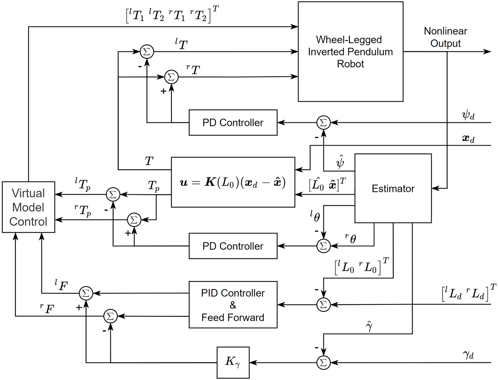
*图 12 综合运动控制系统框图*

## 3 机器人离地检测

综合运动控制系统无法在机器人双轮离地的情况下保持机器人姿态稳定，因此在驱动轮离地后需采用其他控制策略以避免空中姿态发散。为保证控制系统能够快速且准确的进行切换，可靠的机器人离地检测算法至关重要。

### 3.1 支持力解算

通过加速度计与关节电机力矩反馈解算地面对机器人驱动轮竖直向上的支持力判断机器人是否离地可兼顾快速性和准确性。定义机器人驱动轮受地面竖直向上的支持力 $F_N$，如图所示。

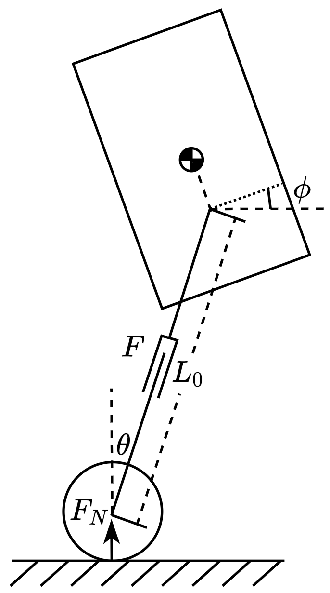
*图 13 支持力定义图*

对于驱动轮竖直方向受力情况，有：

$$
F_N-P-m_wg = m_w\ddot z_w
$$

P 为机器人腿部机构作用于驱动轮竖直向下的力，忽略机器人腿部机构质量，有：

$$
P \approx F\cos\theta+\frac{T_p\sin\theta}{L_0}
$$

其中 F、$T_p$ 由电机力矩反馈经解算得到。

$\ddot z_w$ 为驱动轮竖直方向运动加速度：

$$
\begin{aligned}
\ddot z_w \\
&= \frac{\mathrm d^2}{\mathrm {dt}^2}(z_M - L_0\cos\theta) \\
&= \frac{\mathrm d}{\mathrm {dt}}(\dot z_M - \dot L_0\cos\theta + L_0\dot\theta\sin\theta) \\
&= \ddot z_M - \ddot L_0\cos\theta+2\dot L_0\dot\theta \sin\theta +L_0\ddot\theta\sin\theta+L_0\dot\theta^2\cos\theta \\
\end{aligned}
$$

其中 $\ddot z_M$ 为机体竖直方向运动加速度，可由加速度计测量值结合姿态矩阵消去重力加速度得到。

### 3.2 试验验证

令机器人从20cm高台阶跃下，观察从初始静止到落地静止过程中解算得到的左右轮支持力。

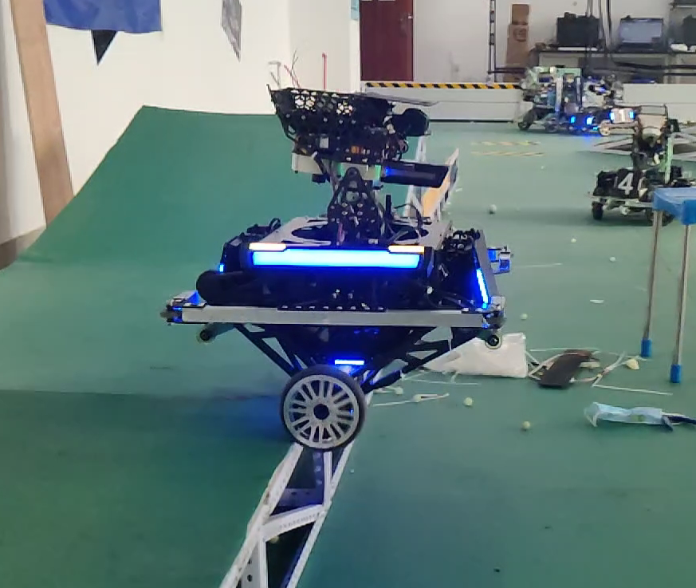
*图 14 台阶跃下实验场景*

过程中左右轮支持力如下图所示。机器人于 t = 0.3s 时刻开始运动，加速到 t = 1.05s 时机器人到达台阶边缘，支持力 $F_N$ 迅速下降。驱动轮于 t = 1.27s 时刻触地，解算出的支持力 $F_N$ 由于撞击发生剧烈波动，最终机器人于 t = 2.5s 时刻完全静止。

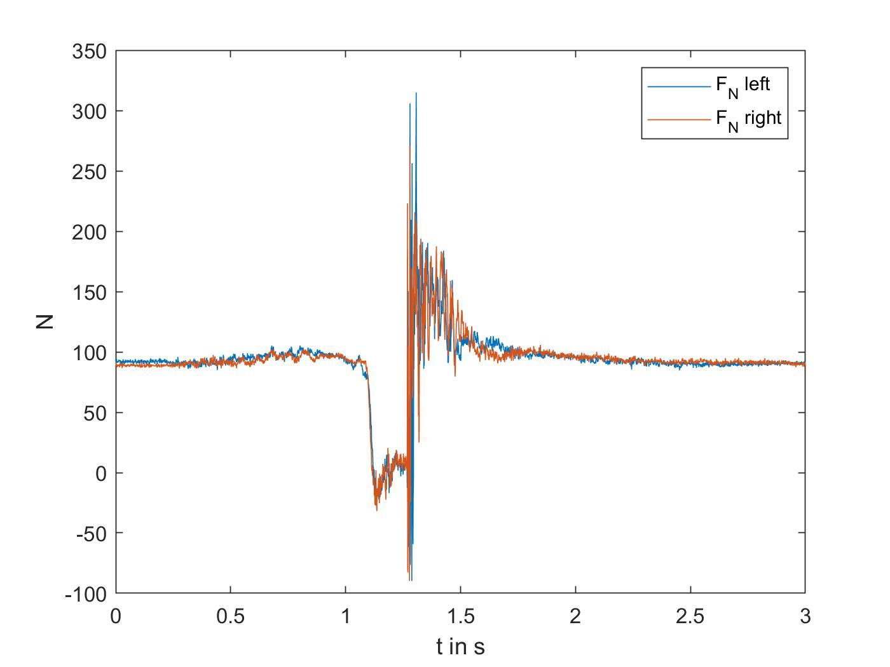
*图 15 左右轮支持力曲线*

当支持力 $F_N < 20\,\mathrm{N}$ 时驱动轮与地面的最大静摩擦不足以使系统稳定，故认为机器人离地，将反馈增益矩阵中除 $K_{21}, K_{22}$ 外全部置零，仅通过关节电机力矩保持腿部姿态竖直。通过这种方法可使机器人稳定通过飞坡，如图所示。

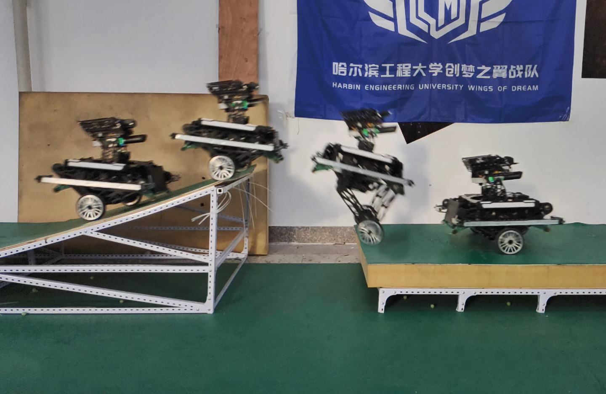
*图 16 稳定通过飞坡*

该策略可极大程度提高机器人空中姿态稳定性，进而使机器人以良好姿态落地，并借助腿部五连杆机构极长的缓冲行程实现真正的“平稳通过飞坡”。

## 参考文献

[1] Dawn Tilbury, Bill Messner, Rick Hill. Control Tutorials for MATLAB and Simulink CTMS. http://ctms.engin.umich.edu/CTMS/index.php?aux=Home.

[2] V. Klemm et al., "Ascento: A Two-Wheeled Jumping Robot," 2019 International Conference on Robotics and Automation (ICRA), 2019, pp. 7515-7521, doi: 10.1109/ICRA.2019.8793792.

[3] S. Wang et al., "Balance Control of a Novel Wheel-legged Robot: Design and Experiments," 2021 IEEE International Conference on Robotics and Automation (ICRA), 2021, pp. 6782-6788, doi: 10.1109/ICRA48506.2021.9561579.

[4] 于红英, 唐德威, 王建宇. 平面五杆机构运动学和动力学特性分析[J]. 哈尔滨工业大学学报, 2007(06): 940-943.

[5] 谢惠祥. 四足机器人对角小跑步态虚拟模型直觉控制方法研究[D]. 国防科学技术大学, 2015.

本文使用 Zhihu On VSCode 创作并发布。

赞同 1916 129 条评论 分享 喜欢 收藏 申请转载

标签：RoboMaster / 机器人 / 自动控制

## 关于作者

**韭菜的菜**

被教育行业在岗咸鱼

南方科技大学 智能制造与机器人硕士在读

主页栏目：回答 / 文章 / 关注者
