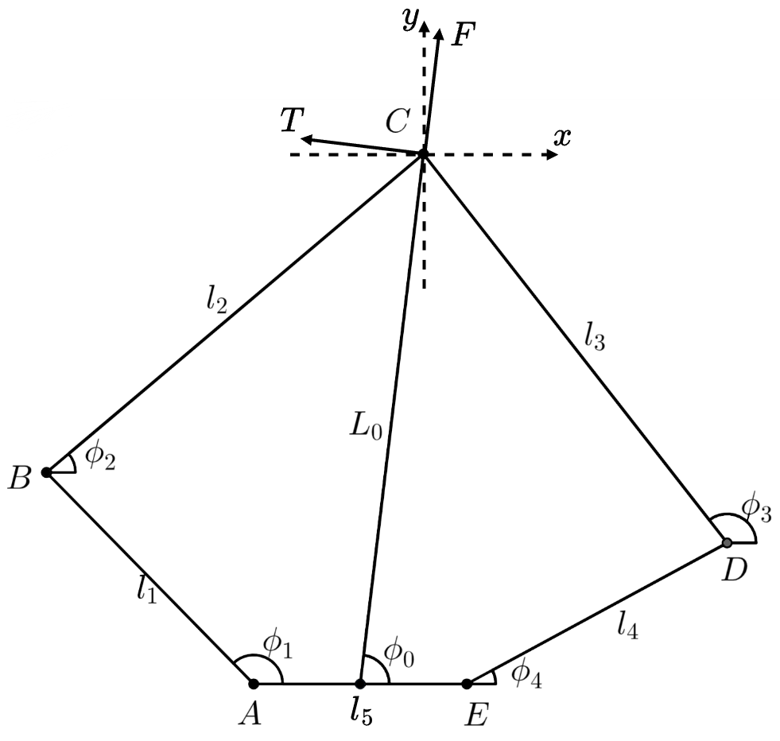

# 五连杆运动学解算与VMC

## 1 正运动学解算



五连杆机构参数定义如图所示，其中$A,E$两转动副由电机驱动，其角度$\phi_1,\phi_4$可通过电机编码器测得。控制任务中主要关注五连杆机构末端$C$点的位置，通常可用直角坐标$(x,y)$或极坐标$(L_0, \phi_0)$表示。

通过五连杆左右两部分列写$C$点坐标，可得到以下等式：

$$
\left\{\begin{array}{l} {x}_{{B}}+{l}_{2} \cos \phi_{2}={x}_{{D}}+{l}_{3} \cos \phi_{3} \\ {y}_{{B}}+{l}_{2} \sin \phi_{2}={y}_{{D}}+{l}_{3} \sin \phi_{3} \end{array}\right.\tag{1.1}\label{eq1_1}
$$

求解方程组可得到角度$\phi_2$：

$$
\phi_{2}=2 \arctan \left(\frac{{B}_{0} + \sqrt{{A}_{0}^{2}+{B}_{0}^{2}-{C}_{0}^{2}}}{{A}_{0}+{C}_{0}}\right)\tag{1.2}
$$

其中：

$$
A_0 = 2l_2(x_D-x_B)\\ B_0=2l_2(y_D-y_B)\\ C_0=l_2^2+l_{BD}^2-l_3^2\\ l_{BD}=\sqrt{(x_D-x_B)^2+(y_D-y_B)^2}
$$

通过角度$\phi_2$即可解算出$C$点直角坐标$(x,y)$：。

$$
\left\{\begin{array}{l} x_C = {l}_{1}\cos \phi_{1}+{l}_{2} \cos \phi_{2}\\ y_C = {l}_{1}\sin \phi_{1}+{l}_{2} \sin \phi_{2} \end{array}\right.\tag{1.3}\label{eq1_3}
$$

进而得到极坐标$(L_0, \phi_0)$：

$$
\left\{\begin{array}{l} L_0 = \sqrt{(x_C-l_5/2)^2+y_C^2}\\ \phi_0 = \arctan{\frac{y_C}{x_C-l_5/2}} \end{array}\right.\tag{1.4}
$$

## ２ VMC雅可比矩阵

VMC (virtual model control) 是一种直觉控制方式，其关键是在每个需要控制的自由度上构造恰当的虚拟构件以产生合适的虚拟力。虚拟力不是实际执行机构的作用力或力矩，而是通过执行机构的作用经过机构转换而成。对于一些控制问题，我们可能需要将工作空间(Task Space) 的力或力矩映射成关节空间(Joint Space) 的关节力矩。

在该五连杆问题中，我们需要获得五连杆机构末端沿腿的推力$F$与沿中心轴的力矩$T_p$（分别对应极坐标$L_0, \phi_0$）与$A,E$两转动副的驱动电机力矩$T_1, T_2$的映射关系。定义$\boldsymbol x = [L_0 \;\; \phi_0]^T,\boldsymbol q = [\phi_1 \;\; \phi_4]^T$，对正运动学模型$\boldsymbol x = f(\boldsymbol q)$求全微分得：

$$
\left\{\begin{array}{c} \delta L_{0}=\frac{\partial f_{1}}{\partial \phi_{1}} \delta \phi_{1}+\frac{\partial f_{1}}{\partial \phi_{4}} \delta \phi_{4} \\ \delta \phi_{0}=\frac{\partial f_{2}}{\partial \phi_{1}} \delta \phi_{1}+\frac{\partial f_{2}}{\partial \phi_{4}} \delta \phi_{4} \end{array}\right.\tag{2.1}
$$

即：

$$
\delta \boldsymbol{x}=\left[\begin{array}{cc} \frac{\partial f_{1}}{\partial \phi_{1}}& \frac{\partial f_{1}}{\partial \phi_{4}} \\ \frac{\partial f_{2}}{\partial \phi_{1}} & \frac{\partial f_{2}}{\partial \phi_{4}} \end{array}\right] \delta \boldsymbol{q}\tag{2.2}
$$

定义雅可比矩阵$\boldsymbol J$为：

$$
\boldsymbol{J}=\left[\begin{array}{cc} \frac{\partial f_{1}}{\partial \phi_{1}}& \frac{\partial f_{1}}{\partial \phi_{4}} \\ \frac{\partial f_{2}}{\partial \phi_{1}} & \frac{\partial f_{2}}{\partial \phi_{4}} \end{array}\right]
$$

有：

$$
\delta \boldsymbol{x}=\boldsymbol{J} \delta \boldsymbol{q}\tag{2.3}\label{eq2_3}
$$

即通过雅可比矩阵$\boldsymbol J$将关节速度$\dot {\boldsymbol q}$映射为五连杆姿态变化率$\dot {\boldsymbol x}$。根据虚功原理，有：

$$
\boldsymbol{T}^{\mathrm{T}} \delta \boldsymbol{q}+(-\boldsymbol{F})^{\mathrm{T}} \delta \boldsymbol{x}=0 \tag{2.4}
$$

其中$\boldsymbol T = [T_1 \;\; T_2 ]^T$，$\boldsymbol F = [F \;\; T_p]^T$。将式$\delta \boldsymbol{x}=\boldsymbol{J} \delta \boldsymbol{q}$代入，有：

$$
\boldsymbol T = \boldsymbol J^T \boldsymbol F \tag{2.5}
$$

综上通过正运动学模型雅可比矩阵即可解算出关节电机输出力矩。

但对上文推导出的正运动学模型直接求取雅可比矩阵$\boldsymbol J$并不是好办法，因为模型表达式中包含大量平方与三角函数及其嵌套运算，直接调用符号运算工具的求雅可比矩阵函数会得到极其复杂的结果，无法转移到嵌入式平台进行计算，故需要通过其他方法来计算。

根据式$\eqref{eq2_3}$可知，雅可比矩阵$\boldsymbol J$实际描述的是两坐标微分的线性映射关系，因此我们可以通过计算速度映射关系来得到雅可比矩阵。

对式$\eqref{eq1_3}$求导可得：

$$
\left\{\begin{array}{l} \dot x_C = -{l}_{1}\dot\phi_1\sin \phi_{1}-{l}_{2}\dot\phi_2 \sin \phi_{2}\\ \dot y_C = {l}_{1}\dot\phi_1\cos \phi_{1}+{l}_{2}\dot\phi_2 \cos \phi_{2} \end{array}\right.\tag{2.6}\label{eq2_6}
$$

其中$\dot\phi_1$可由电机编码器测得。对式$\eqref{eq1_1}$求导可计算$\dot\phi_2$：

$$
\left\{\begin{array}{l} \dot{x}_{{B}}-{l}_{2}\dot\phi_2 \sin \phi_{2}=\dot{x}_{{D}}-{l}_{3}\dot\phi_{3} \sin \phi_{3} \\ \dot{y}_{{B}}+{l}_{2}\dot\phi_2  \cos \phi_{2}=\dot{y}_{{D}}+{l}_{3}\dot\phi_{3} \cos \phi_{3} \end{array}\right.\tag{2.7}
$$

消去$\dot\phi_3$求得$\dot\phi_2$：

$$
\dot{\phi}_{2}=\frac{\left(\dot{x}_{{D}}-\dot{{x}}_{{B}}\right) \cos \phi_{3}+\left(\dot{{y}}_{{D}}-\dot{{y}}_{{B}}\right) \sin \phi_{3}}{{l}_{2} \sin \left(\phi_{3}-\phi_{2}\right)}\tag{2.8}\label{eq2_8}
$$

其中：

$$
\left\{\begin{array}{l} \dot x_B = -{l}_{2}\dot\phi_1\sin \phi_{1}\\ \dot y_B = {l}_{2}\dot\phi_1\cos \phi_{1}\\ \dot x_D = -{l}_{4}\dot\phi_4\sin \phi_{4}\\ \dot y_D = {l}_{4}\dot\phi_4\cos \phi_{4} \end{array}\right.
$$

将$\dot\phi_2$代入式$\eqref{eq2_6}$即可得到：

$$
\left\{\begin{array}{l} \dot x_C = -{l}_{2}\dot\phi_1\sin \phi_{1}-{l}_{2}\left(\frac{\left(\dot{x}_{{D}}-\dot{{x}}_{{B}}\right) \cos \phi_{3}+\left(\dot{{y}}_{{D}}-\dot{{y}}_{{B}}\right) \sin \phi_{3}}{{l}_{2} \sin \left(\phi_{3}-\phi_{2}\right)}\right) \sin \phi_{2}\\ \dot y_C = {l}_{2}\dot\phi_1\cos \phi_{1}+{l}_{2}\left(\frac{\left(\dot{x}_{{D}}-\dot{{x}}_{{B}}\right) \cos \phi_{3}+\left(\dot{{y}}_{{D}}-\dot{{y}}_{{B}}\right) \sin \phi_{3}}{{l}_{2} \sin \left(\phi_{3}-\phi_{2}\right)}\right) \cos \phi_{2} \end{array}\right.\tag{2.9}
$$

可以看到，通过这种方法计算的公式不再包含平方与三角函数嵌套运算，三角函数之间的加减乘除也可以利用两角和差公式进一步化简。

利用 MATLAB 进行符号运算，首先定义变量：

```matlab
syms phi1(t) phi2(t) phi3(t) phi4(t) phi_dot_1 phi_dot_4 l1 l2 l3 l4 l5
x_B = l1*cos(phi1);
y_B = l1*sin(phi1);
x_C = x_B+l2*cos(phi2);
y_C = y_B+l2*sin(phi2);
x_D = l5+l4*cos(phi4);
y_D = l4*sin(phi4);
x_dot_B = diff(x_B,t);
y_dot_B = diff(y_B,t);
x_dot_C = diff(x_C,t);
y_dot_C = diff(y_C,t);
x_dot_D = diff(x_D,t);
y_dot_D = diff(y_D,t);
```

根据式$\eqref{eq2_8}$写入$\dot\phi_2$表达式：

```matlab
phi_dot_2 = ((x_dot_D-x_dot_B)*cos(phi3)+(y_dot_D-y_dot_B)*sin(phi3))/l2/sin(phi3-phi2);
```

利用 subs 函数将表达式中 diff(X,t) 类型的符号变量替换为记作 X_dot 的基本符号变量：

```matlab
x_dot_C = subs(x_dot_C,diff(phi2,t),phi_dot_2);
x_dot_C = subs(x_dot_C,...
    [diff(phi1,t),diff(phi4,t)],...
    [phi_dot_1,phi_dot_4]);
y_dot_C = subs(y_dot_C,diff(phi2,t),phi_dot_2);
y_dot_C = subs(y_dot_C,...
    [diff(phi1,t),diff(phi4,t)],...
    [phi_dot_1,phi_dot_4]);
```

利用 jacobian 函数求雅可比矩阵：

```matlab
x_dot = [x_dot_C; y_dot_C];
q_dot = [phi_dot_1; phi_dot_4];
x_dot = simplify(collect(x_dot,q_dot));
J = simplify(jacobian(x_dot,q_dot))
```

得：

$$
\left[\begin{array}{c} \dot x_C \\ \dot y_C \end{array}\right]=\left[\begin{array}{cc} \frac{l_1\sin \left(\phi_1 -\phi_2 \right) \sin \phi_3 }{\sin \left(\phi_2 -\phi_3 \right) } & \frac{l_4 \sin \left(\phi_3 -\phi_4 \right)\sin \phi_2  }{\sin \left(\phi_2 -\phi_3 \right) }\\ -\frac{l_1 \sin \left(\phi_1 -\phi_2 \right)\cos\phi_3  }{\sin \left(\phi_2 -\phi_3 \right) } & -\frac{l_4 \sin \left(\phi_3 -\phi_4 \right)\cos \phi_2 }{\sin \left(\phi_2 -\phi_3 \right) } \end{array}\right]\left[\begin{array}{c} \dot \phi_1 \\ \dot \phi_4 \end{array}\right]\tag{2.10}
$$

记作：

$$
\left[\begin{array}{c} \dot x_C \\ \dot y_C \end{array}\right]=\boldsymbol J\left[\begin{array}{c} \dot \phi_1 \\ \dot \phi_4 \end{array}\right]
$$

根据上式，可得到关节力矩$[T_1 \;\; T_2 ]^T$与虚拟力$[F_x\;\; F_y]^T$的映射关系：

$$
\left[\begin{array}{c}  T_1 \\  T_2 \end{array}\right]=\boldsymbol J^T\left[\begin{array}{c} F_x \\ F_y \end{array}\right]\tag{2.10}\label{eq2_10}
$$

利用旋转矩阵$\boldsymbol R$将$[F_x\;\; F_y]^T$旋转至极坐标方向：

$$
\left[\begin{array}{c} F_x \\ F_y \end{array}\right] =  \left[\begin{array}{cc} \cos(\phi_0-\pi/2)& -\sin(\phi_0-\pi/2) \\ \sin(\phi_0-\pi/2)&  \cos(\phi_0-\pi/2) \end{array}\right]\left[\begin{array}{c} F_c \\ F_t \end{array}\right]\tag{2.11}\label{eq2_11}
$$

其中$F_t,F_c$分别是末端沿$L_0$和垂直于$L_0$的虚拟力，再利用变换矩阵$\boldsymbol M$可映射至最终的虚拟力$\boldsymbol F = [F \;\; T_p]^T$：

$$
\left[\begin{array}{c} F_t \\ F_c \end{array}\right] =  \left[\begin{array}{cc} 0& -\frac{1}{L_0} \\ 1&   0\end{array}\right]\left[\begin{array}{c} F \\ T_p \end{array}\right]\tag{2.12}\label{eq2_12}
$$

将上述表达式依次代入$\eqref{eq2_10}$得到最终的关节力矩与虚拟力映射关系：

$$
\left[\begin{array}{c}  T_1 \\  T_2 \end{array}\right]=\boldsymbol J^T \boldsymbol R \boldsymbol M\left[\begin{array}{c} F \\ T_p \end{array}\right]\tag{2.13}\label{eq2_13}
$$

利用 MATLAB 进行上述计算：

```matlab
R = [cos(phi0-pi/2) -sin(phi0-pi/2);
     sin(phi0-pi/2)  cos(phi0-pi/2)];
M = [0 -1/L0;
     1     0];
T = simplify(J.'*R*M)
```

得到最终结果：

$$
\left[\begin{array}{c}  T_1 \\ T_2\end{array}\right] = \left[\begin{array}{cc}  \frac{l_1 \sin \left(\phi_0 -\phi_3 \right)\sin \left(\phi_1 -\phi_2 \right) }{\sin \left(\phi_3 -\phi_2 \right) } & \frac{l_1 \cos \left(\phi_0 -\phi_3 \right)\sin \left(\phi_1 -\phi_2 \right) }{L_0 \sin \left(\phi_3 -\phi_2 \right) }\\ \frac{l_4 \sin \left(\phi_0 -\phi_2 \right)\sin \left(\phi_3 -\phi_4 \right) }{\sin \left(\phi_3 -\phi_2 \right) } & \frac{l_4 \cos \left(\phi_0 -\phi_2 \right)\sin \left(\phi_3 -\phi_4 \right) }{L_0 \sin \left(\phi_3 -\phi_2 \right) }  \end{array}\right]\left[\begin{array}{c} F  \\ T_p \end{array}\right]
$$

**参考文献**

[1]于红英,唐德威,王建宇.平面五杆机构运动学和动力学特性分析[J].哈尔滨工业大学学报,2007(06):940-943.

[2]谢惠祥. 四足机器人对角小跑步态虚拟模型直觉控制方法研究[D].国防科学技术大学,2015.
