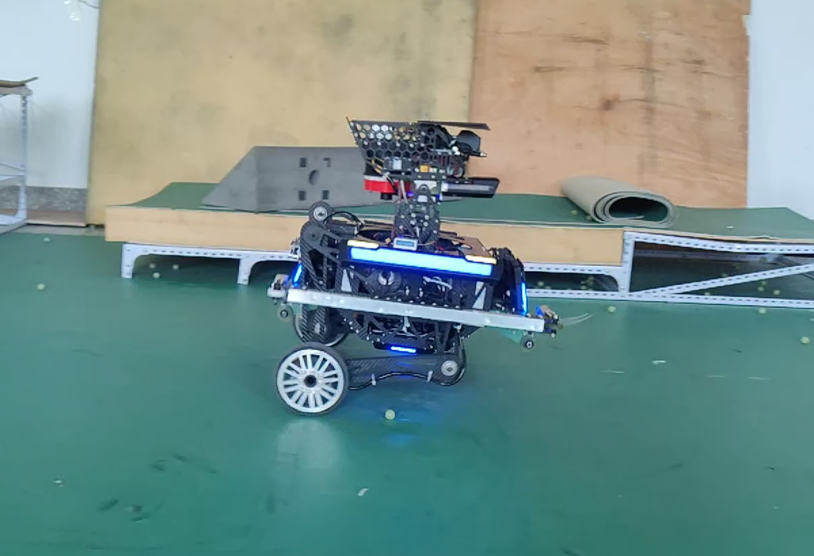
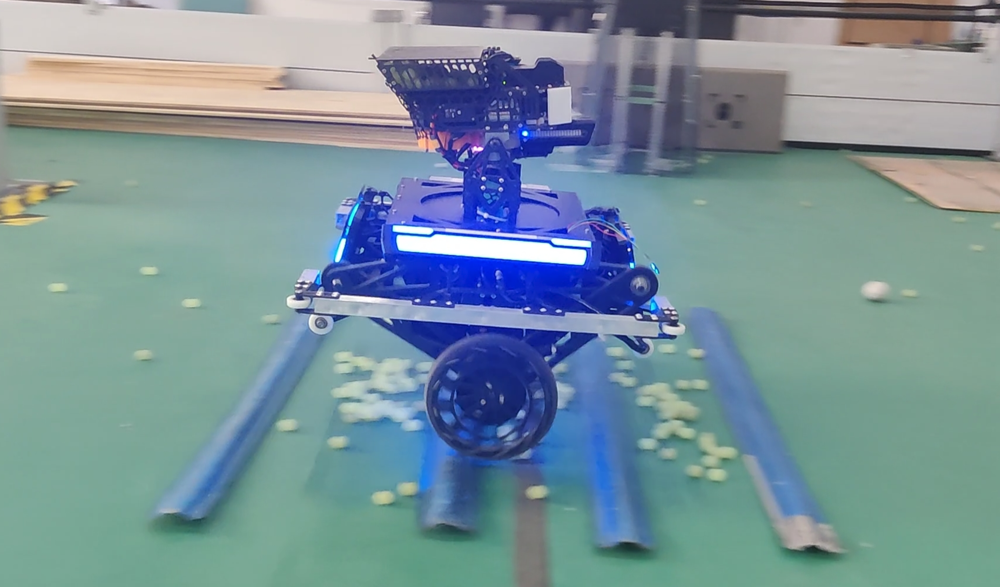
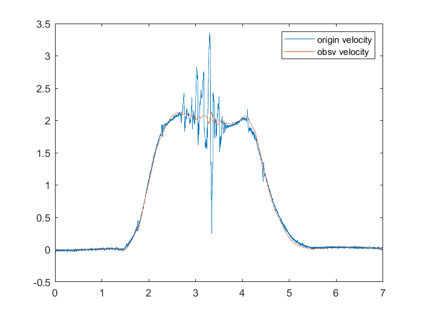

# 轮腿倒立摆机器人运动速度估计

## 速度解算

由于驱动轮相对大地的速度无法直接测得，故通过结合电机编码器与机体陀螺仪解算得到。记驱动轮电机编码器测得转子相对定子角速度为$\omega_{ecd}$、电机定子固定基座（五连杆从动杆，记作$c$系）相对机器人机体（记作$b$系）角速度为$\dot\phi_{bc}$，由运动学解算得到、机器人机体相对大地（记作$e$系）角速度为$\omega_{eb}$，由固定于机体的陀螺仪测得。根据上述三个角速度，即可求出驱动轮转子相对大地角速度$\omega$：

$$
\omega =\omega_{eb}+\dot\phi_{bc}+\omega_{ecd}
$$

假设驱动轮相对水平地面运动为纯滚动，不存在打滑，则驱动轮相对大地平动速度$\dot x$为：

$$
\dot x = \omega R
$$

根据$x = x_b-L_0\sin\theta$，有：

$$
\dot x_b = \dot x+ L_0\dot\theta\cos\theta+\dot L_0\sin\theta
$$

即：

$$
\dot x_b = \omega R+ L_0\dot\theta\cos\theta+\dot L_0\sin\theta
$$

## 速度观测器

机器人在高速运动中驱动轮轧过如17mm小弹丸、盲道等地形突起时却会向前摔倒。

通过观看机器人摔倒过程的慢动作录像得出结论：在机器人轧到地形突起的瞬间，驱动轮会受到来自突起的巨大阻力，使测量得到的机器人速度迅速减小，进而产生巨大的速度跟踪误差。控制系统欲消除此误差需要将驱动轮移动到机器人质心后方，即驱动轮电机会收到一个翻转的力矩，而这个力矩会使轧到凸起后正处于滞空阶段的驱动轮疾速反转，最终导致整个系统彻底发散。

该问题根本上是速度突变与打滑共同作用造成的，因此只要合理处置其中一个现象造成的影响即可避免问题。从结构上思考，更换半径更大、摩擦力更大、质地更软的轮胎，可同时降低速度突变的程度与打滑现象。从算法层面思考，通过融合机器人相对惯性空间的加速度信息，并结合机器人本身动力学模型设计观测器，可获得更加平滑且相对惯性空间的速度观测结果，进而降低速度突变的程度并屏蔽打滑造成的影响。

### 系统建模

考虑到单片机平台运算能力有限，故不根据上文推导的机器人动力学模型设计状态观测器，仅利用单纯运动学模型对该问题进行建模，设状态：

$$
\boldsymbol x =\left[\begin{array}{c}v\\a\\\end{array}\right]
$$

其状态空间方程可表示为：

$$
\frac{\mathrm d}{\mathrm dt}\left[\begin{array}{c}v\\a\\\end{array}\right] = \left[\begin{array}{cc}0 & 1\\0 & 0\\\end{array}\right]\left[\begin{array}{c}v\\a\\\end{array}\right]
$$

### 观测器设计

根据上述匀加速模型设计卡尔曼滤波器，过程模型为：

$$
\boldsymbol  x_{k+1} = \boldsymbol F_k\boldsymbol  x_k + \boldsymbol{\Gamma}_{k}\boldsymbol {w}_{k}, \quad \boldsymbol {w}_{k} \sim N\left(0,  Q_k \right)
$$

其中：

$$
\boldsymbol F_k =\left[\begin{array}{cc}1 &  \Delta t \\0 &  1 \end{array}\right], \quad\boldsymbol \Gamma_k = \left[\begin{array}{c}{\frac{1}{2}\Delta t^2}\\{\Delta t} \\\end{array}\right]
$$

过程噪声方差$Q_k$为：

$$
Q_k =\sigma^2
$$

量测模型如下：

$$
\boldsymbol  z_{k} = \boldsymbol H_k\boldsymbol x_k + \boldsymbol {v}_{k}
$$

采用通过速度解算得到的机器人速度，与惯导解算得到的机器人相对惯性空间的加速度作为量测向量，则：

$$
\begin{aligned}\boldsymbol H_k &= \left[\begin{array}{cc}1 & 0  \\0  &1 \end{array}\right],\boldsymbol {v}_{k} \sim N\left(\boldsymbol 0_{2 \times 1}, \boldsymbol {R}_k\right)\end{aligned}
$$

量测噪声$\boldsymbol R_k$为：

$$
\boldsymbol R_k =\left[\begin{array}{ccc}\sigma_v^2 &  0 \\0 &  \sigma_a^2\end{array}\right]
$$

其中$\sigma_v^2,\sigma_a^2$分别为速度与加速度的测量噪声方差。

### 试验验证

机器人可以 2m/s 的速度稳定通过图示复杂路面。

过程中机器人速度解算结果与速度观测结果如图所示。

可以看出，速度观测结果可以很大程度降低轧过地形突起瞬间速度突变的程度，给予控制系统稳定可靠高质量的速度反馈值。
